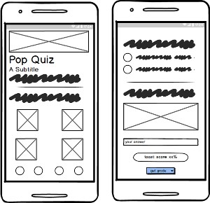
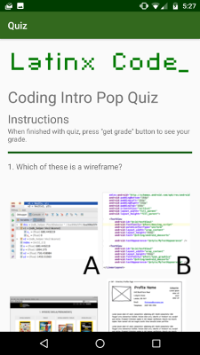
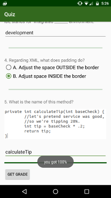

# Final Exam - Quiz App
Final Project for Grow With Google Challenge Scholarship: Android Basics. Made simple quiz app with different forms of answer entry, and score count.

## Mockup and Screenshots

## Project Overview
The Quiz App project is a chance for the student to combine and practice everything you learned in this section of the course. The student will be making their own Android app - taking it from the idea stage to building out the full app. The student can share their app with family and friends, as well as with other students in this course.

The goal is to create an educational app that quizzes a user about a certain topic. The student should be creative about how to accomplish this. It’s up to the student what the quiz questions will be about and how to present them to the end user. (4 - 10 quiz questions are recommended for a reasonable scope of the app).

### Developer Notes
* Because I may replicate this for my students at [Latinx Code](http://latinxcode.com), I decided to make the quiz geared towards those who are beginning to learn Java, much like myself.
* After testing the layout on a friend, I decided upon the current layout for the checkboxes. 
* I edited the styles.xml file to reflect the color palette I made for Latinx Code.

### Skills Demonstrated

* Planning an app app design before coding.
* Taking an app layout from drawing/wireframe to XML code.
* Creating, positioning, and styling views.
* Creating interactivity through button clicks and Java code.
* Commenting and documenting your code.

## Requirements

### Layout
* App contains 4 - 10 questions, including at least one check box, one radio button, and one text entry.
* Questions are in a variety of formats such as free text response, checkboxes, and radio buttons.
* App includes a button for the user to submit their answers and receive a score.
  * The code adheres to all of the following best practices:
  * Text sizes are defined in sp
  * Lengths are defined in dp
  * Padding and margin is used appropriately, such that the views are not crammed up against each other.
* The app includes at least four of the following Views: TextView, ImageView, Button, Checkbox, EditText, LinearLayout, RelativeLayout, ScrollView, RadioButton, RadioGroup.
* The app gracefully handles displaying all the content on screen when rotated. Either by updating the layout, adding a scrollable feature or some other mechanism that adheres to Android development guidelines.

### Functionality
* The code runs without errors.
* Each question has a correct answer.
* Any question which uses radio buttons allows only one to be checked at once.
* The app contains at least one if/else statement
* The grading button displays a toast which accurately displays the results of the quiz.
* The grading logic checks each answer correctly. The app accurately calculates the number of correct answers and does not include incorrect answers in the count.

### Code Readability
* All variables, methods, and resource IDs are descriptively named such that another developer reading the code can easily understand their function.
* The code is properly formatted i.e. there are no unnecessary blank lines; there are no unused variables or methods; there is no commented out code.
* The code also has proper indentation when defining variables and methods.

## Deployment

To build, clone this repository using Android studio, then [export](https://stackoverflow.com/questions/16622843/how-do-i-export-a-project-in-the-android-studio).

## Built With

* Android Studio
* Balsamiq Mockups
* Ubuntu 17.10 64-bit
* Tested on Moto X Pure Edition (Android Phone)
